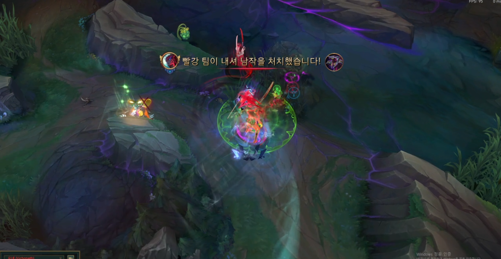
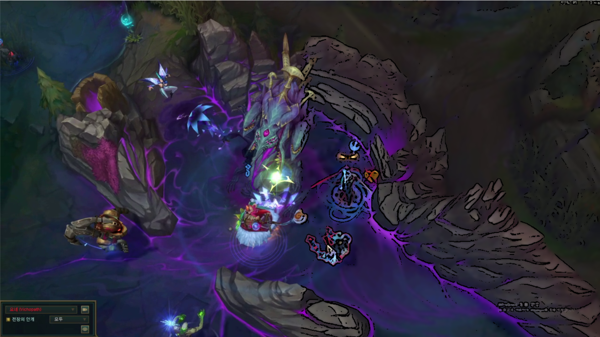
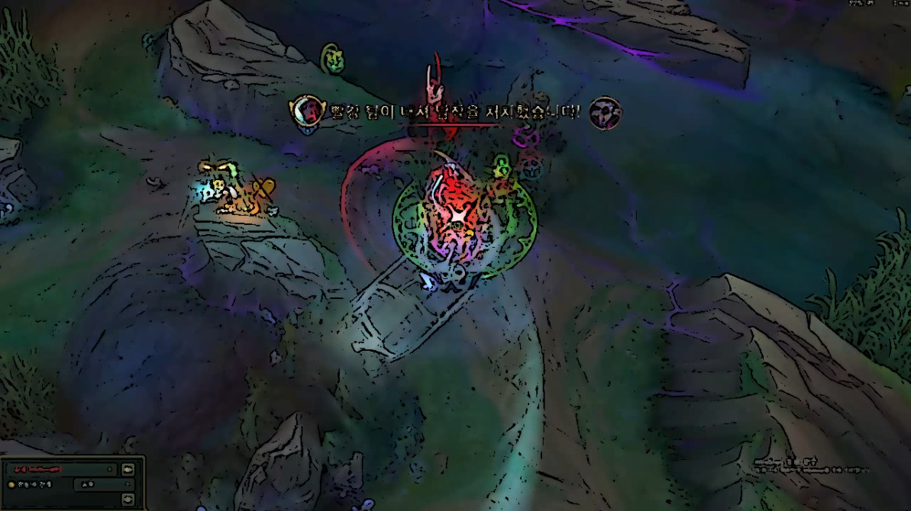

Python의 cv2를 사용하여 카툰스타일의 영상으로 변환하기  
convert video to cartoon style  

기능: 카툰 스타일로 변환, 원본비교  

카툰 스타일로 변환: input_video.mp4를 카툰 스타일의 output_video_cartoon.mp4로 변환하여 저장  

변화과정 확인: 가로의 길이가 1280픽셀인 경우 왼쪽에는 원본 오른쪽에는 변환된 영상을 실행중에 확인할 수 있음  

영상을 변환하기 전
  

영상을 변환하는 도중에 확인할 수 있는 비교 영상
  

영상을 변환한 후
  