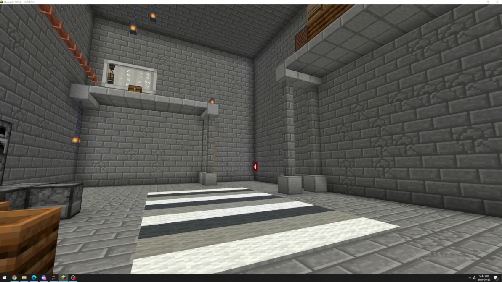
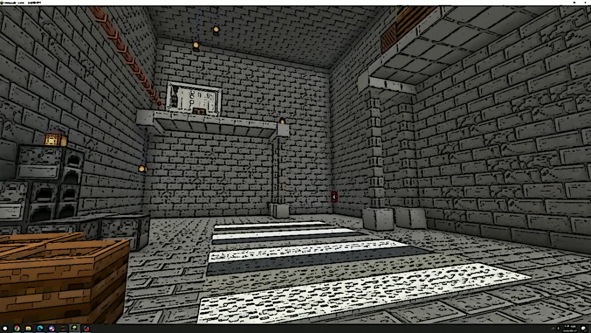

Python의 cv2를 사용하여 카툰스타일의 영상으로 변환하기  
convert video to cartoon style  

기능: 카툰 스타일로 변환, 원본비교  

카툰 스타일로 변환: input_video.mp4를 카툰 스타일의 output_video_cartoon.mp4로 변환하여 저장  

변화과정 확인: 가로의 길이가 1280픽셀인 경우 왼쪽에는 원본 오른쪽에는 변환된 영상을 실행중에 확인할 수 있음  

영상을 변환하기 전
  

영상을 변환하는 도중에 확인할 수 있는 비교 영상
  

영상을 변환한 후
  

한계: 위 사진들을 통해 LeagueofLegneds에서 벽같은 부분은 잘 표시되었다고 할 수 있지만 게임 캐릭터의 경우 제대로 표현되지 않음을 확인할 수 있음, 즉 크고 변화가 많이 없는 부분에 대해서는 처리를 잘 하지만 작고 변화가 많은 부분에 대해서 제대로 처리하지 못함을 알 수 있음  

추가 예시: 마인크래프트의 크고 변화가 적은 부분에 대해서 잘 변환되었지만 양탄자 부분은 제대로 변환이 이루어지지 않았음을 확인할 수 있음  

영상을 변환하기 전
  

영상을 변환한 후

